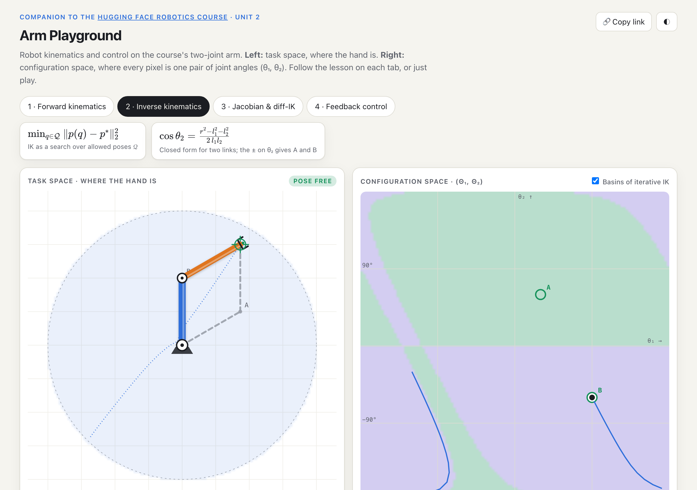
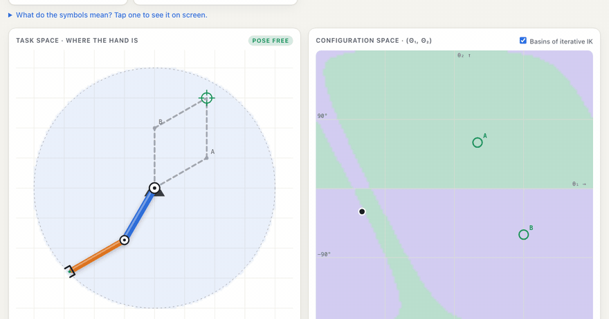
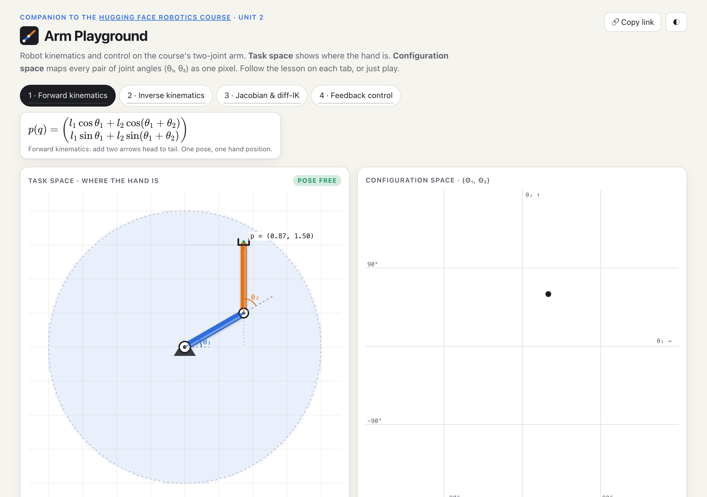
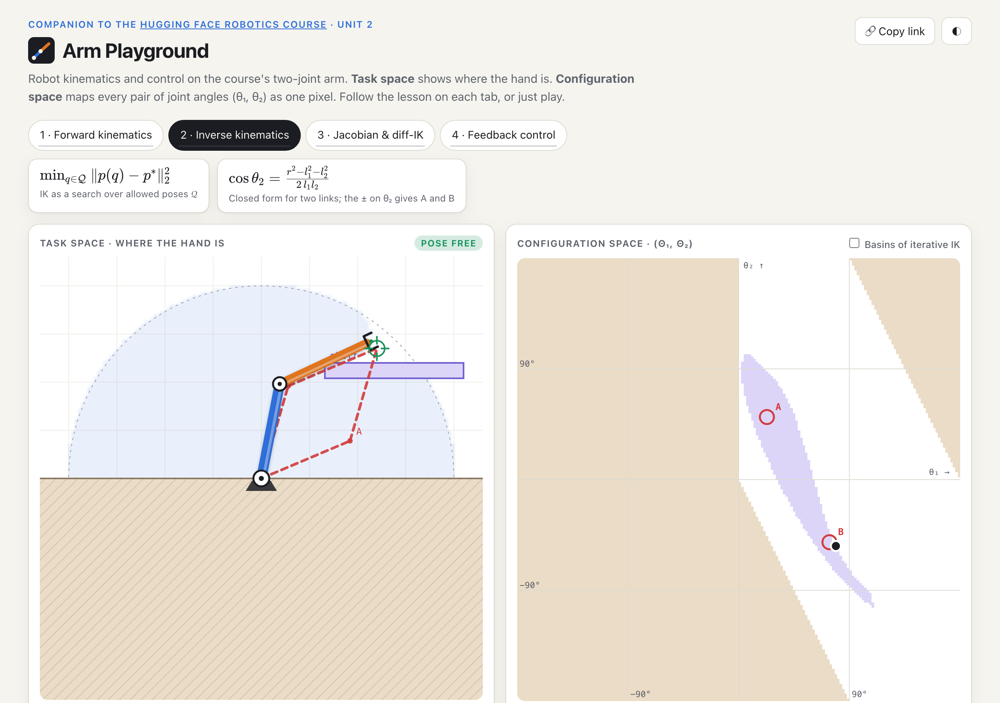
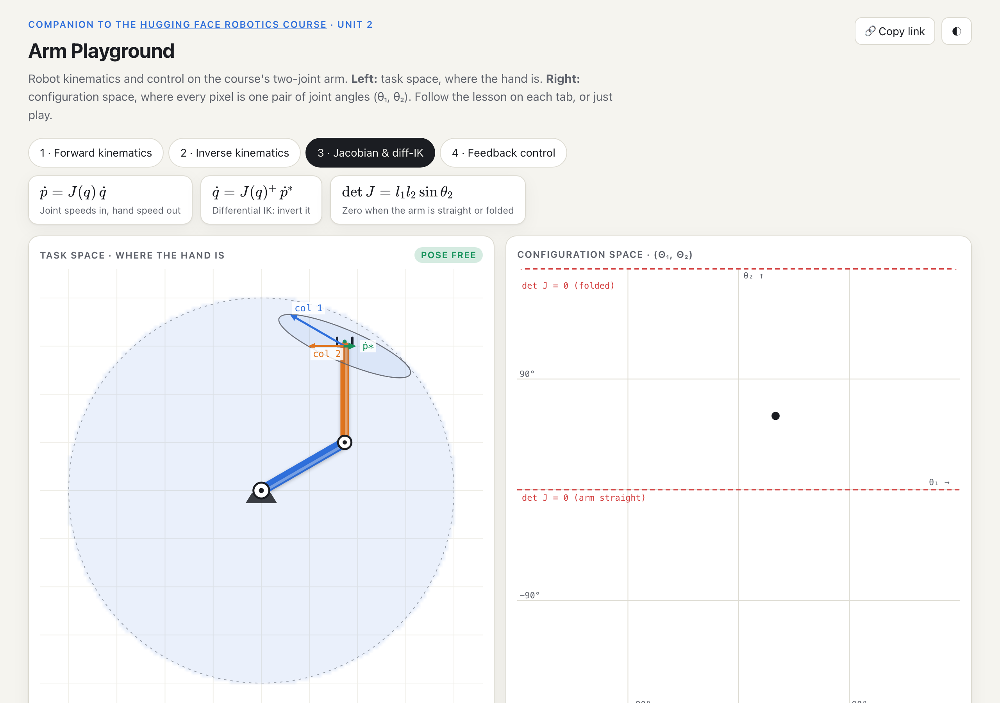
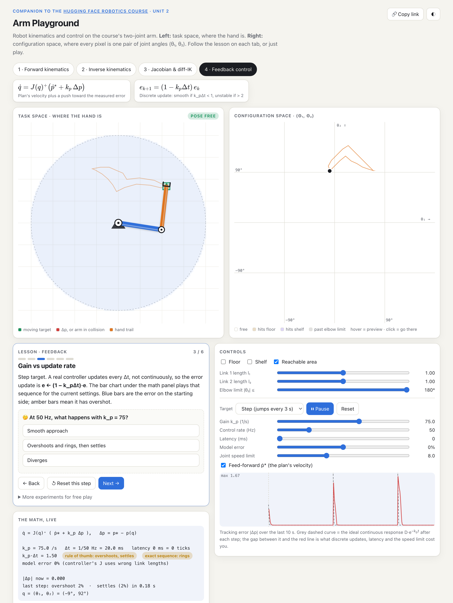
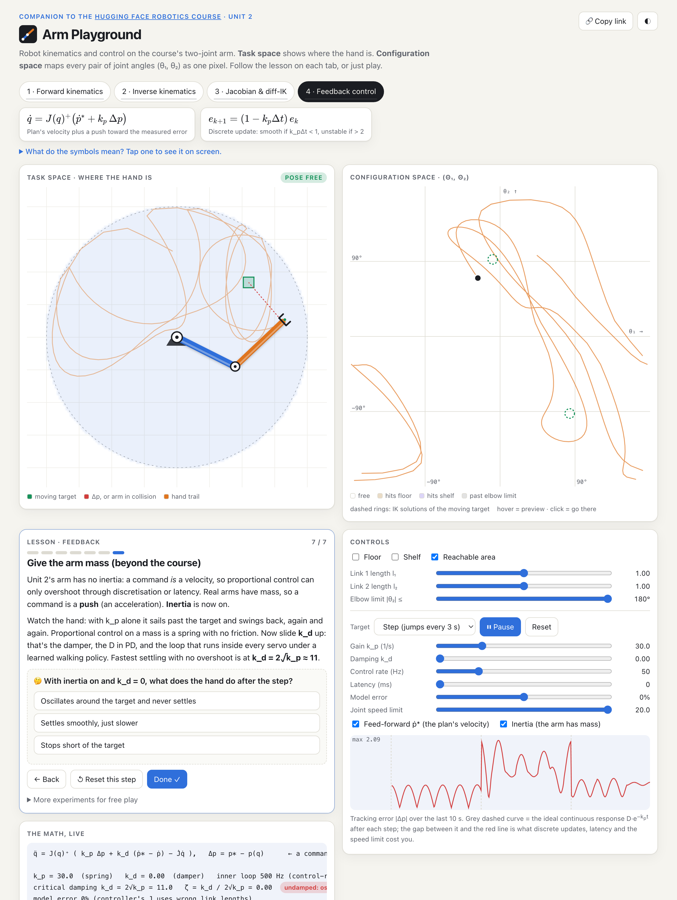
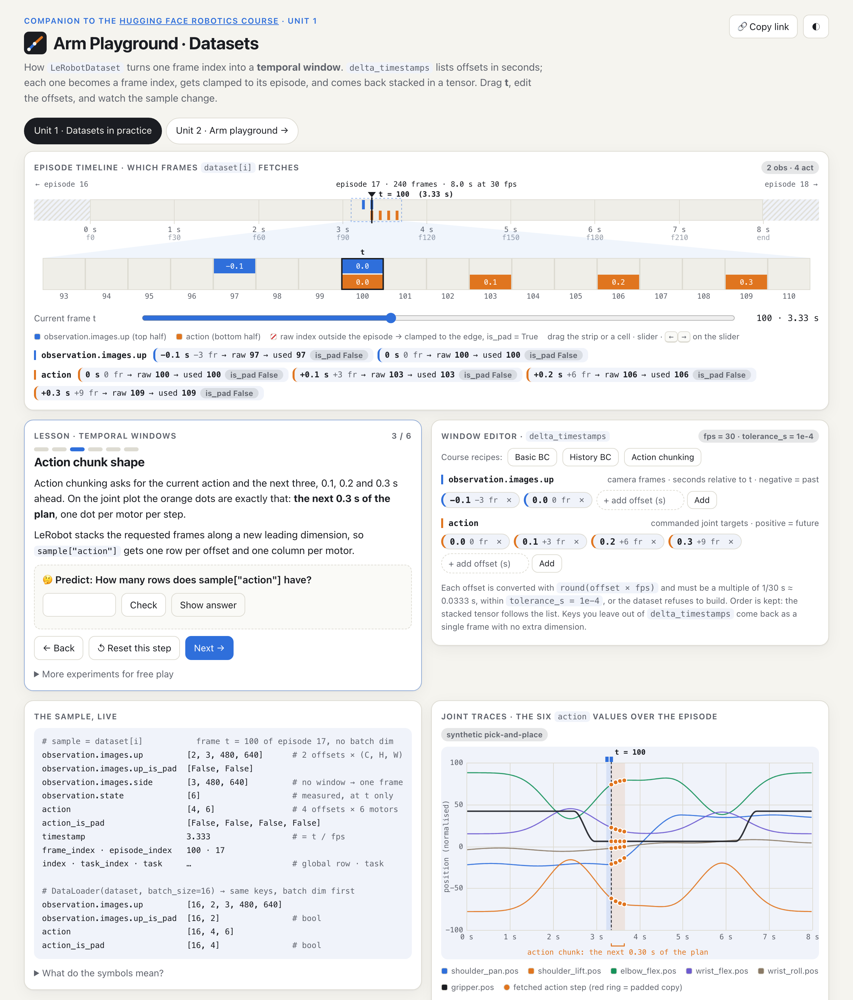

<p align="center">
  <a href="https://bakulbadwal.github.io/arm-playground/">
    <picture>
      <source media="(prefers-color-scheme: dark)" srcset="docs/dark.png">
      
    </picture>
  </a>
</p>

<h1 align="center">Arm Playground</h1>

<p align="center">
  <b>Learn robot kinematics and control by touching them.</b><br>
  An interactive two-joint arm with 24 guided lessons, built as a companion to<br>
  <a href="https://huggingface.co/learn/robotics-course/unit2/1">Unit 2 · Classical Robotics</a> of the <a href="https://huggingface.co/learn/robotics-course">Hugging Face Robotics Course</a>,<br>
  plus a <a href="https://bakulbadwal.github.io/arm-playground/datasets.html">second page for Unit 1</a>: what <code>LeRobotDataset</code> actually fetches when you ask for a temporal window.
</p>

<p align="center">
  <a href="https://bakulbadwal.github.io/arm-playground/"><b>▶ Open the playground</b></a> ·
  <a href="https://bakulbadwal.github.io/arm-playground/datasets.html"><b>▶ Unit 1 · Datasets</b></a> ·
  <a href="#whats-inside">What's inside</a> ·
  <a href="#how-it-compares">How it compares</a> ·
  <a href="#deep-links-for-teachers">Deep links</a>
</p>

<p align="center">
  
  
  
  <a href="https://huggingface.co/spaces/bacool/arm-playground"></a>
</p>

<p align="center"><sub>Also hosted as a <a href="https://huggingface.co/spaces/bacool/arm-playground">Hugging Face Space</a>, and the source of the diagrams offered to the course in <a href="https://github.com/huggingface/robotics-course/pull/37">huggingface/robotics-course#37</a>.</sub></p>

<p align="center">
  
  <br><sub>Iterative IK racing to a solution. The map's green and purple regions are the basins of attraction: start anywhere in green and you converge to A, purple to B.</sub>
</p>

---

## Why this exists

Unit 2 of the Hugging Face Robotics Course makes one argument: *even a two-joint arm needs real math to control, and that math breaks on contact, clutter and cameras, which is why the field is learning from data.* The unit gives the equations (forward kinematics, inverse kinematics, the Jacobian, feedback) but no way to push on them. Its source even carries TODO placeholders for the diagrams.

This playground is those diagrams, made interactive. Every equation in the unit is a slider, a drag or a button, and each tab walks you through it with **predict-then-check questions**: you commit to a number before the answer appears.

It uses the course's own notation (q = [θ₁, θ₂], p(q), J(q)⁺, k_p Δp) and its running example: the SO‑100 arm with four joints locked, so it moves in a plane.

## What's inside

Two views, always in sync. **Task space:** where the hand is. **Configuration space:** every pixel is one pose (θ₁, θ₂). Hover it to preview that pose as a ghost arm; click to go there. Turn on a floor or shelf and watch them carve regions out of the map. Every tab has a **"What do the symbols mean?"** key: tap a symbol and the matching thing on screen pulses, so `J(q)` stops being notation and becomes "those two arrows at the hand."

| Tab | You learn | You can | Lesson |
|---|---|---|---|
| **1 · Forward kinematics** | FK is two arrows added head to tail; θ₂ is *relative*; the workspace is a ring | Drive θ₁, θ₂; change link lengths; hover the pose map | 6 steps |
| **2 · Inverse kinematics** | IK has 0, 1 or 2 answers; obstacles delete them; iterative solvers find the one whose basin you start in | Drag a target; jump to either solution; run an **iterative (damped least-squares) solver** and see its path; paint the **basins of attraction** | 6 steps |
| **3 · Jacobian & diff-IK** | J's columns are each joint's "nudge"; det J = l₁l₂ sin θ₂; singularities make joint speeds explode | **Wiggle** a joint to see its column; drag a desired hand velocity; run diff-IK into a singularity with a plain vs **damped** inverse; **teleop** the hand with arrow keys | 5 steps |
| **4 · Feedback control** | Open loop trusts the model; feedback fixes model error; k_p·Δt > 1 overshoots, > 2 diverges; latency and saturation change the picture; tracking isn't planning; and, beyond the course, **why PD needs mass**: P on an arm with inertia is an undamped spring, k_d is the damper | Step, circle, sweep or drag targets; vary **gain, control rate, latency, model error, joint speed limit**; watch the error trace against the **ideal e^(−k_p t) response**, step-response metrics and the **discrete error sequence**; switch on **inertia** and tune k_d to critical damping | 7 steps |

<table>
  <tr>
    <td width="50%"><br><sub><b>Forward kinematics.</b> The grey dashes show θ₂ is measured from link 1.</sub></td>
    <td width="50%"><br><sub><b>Inverse kinematics with obstacles.</b> The target is inside the ring, but the shelf blocks both solutions.</sub></td>
  </tr>
  <tr>
    <td width="50%"><br><sub><b>Jacobian.</b> Columns as arrows, the velocity ellipse, and the det J = 0 rows.</sub></td>
    <td width="50%"><br><sub><b>Feedback control.</b> Lesson, live math, error trace and step metrics.</sub></td>
  </tr>
  <tr>
    <td width="50%"><br><sub><b>Give the arm mass.</b> With inertia on, proportional control alone is an undamped spring; k_d is the damper.</sub></td>
    <td width="50%"><br><sub><b>Unit 1 · Datasets.</b> Drag a frame through an episode and watch <code>delta_timestamps</code> become indices, clamps, masks and tensor shapes.</sub></td>
  </tr>
</table>

## The Unit 1 page: datasets in practice

Unit 1's only code (page 1.4) is about `delta_timestamps`: asking `LeRobotDataset` for a window of past observations and future actions around one frame. The course explains it with a static diagram. [`datasets.html`](https://bakulbadwal.github.io/arm-playground/datasets.html) makes it live, against the real facts of `lerobot/svla_so101_pickplace` (50 episodes, 11,939 frames, 30 fps, six motors, two 480×640 cameras) and the fetch rule in lerobot 0.6.1's `dataset_reader.py`:

- **Episode timeline.** Drag *t* through a 240-frame episode. Observation frames light up blue, action frames orange, and any offset that runs past the episode edge is drawn hatched red with an arrow showing it being **clamped** back to the edge frame and flagged in `{feature}_is_pad`. It never crosses into the neighbouring episode.
- **Window editor** with the course's three recipes (basic BC, history BC, action chunking). An offset that isn't a whole number of frames, like 0.05 s at 30 fps, shows the same `ValueError` LeRobot raises.
- **Joint traces** of the six action values with the fetched chunk marked, so "the next 0.3 s of the plan" is something you can see.
- **The sample, live**: every key of `dataset[t]` with its tensor shape, the `_is_pad` masks, and the batched shapes from a `DataLoader`, including the 0.6.1 quirk that a single-offset video window is squeezed to `[3, 480, 640]` while `action` keeps `[1, 6]`.
- **The exact Python** for the current window, copyable, plus the working form of streaming (`next(iter(...))`, since `StreamingLeRobotDataset` is an `IterableDataset` and the course's `streaming_dataset[100]` raises).
- **Six predict-then-check lessons**, from "how many frames is 0.1 s" to why a padded chunk must be masked in the loss (ACT multiplies its L1 loss by `~action_is_pad`).

## How it compares

Two-link arm visualisers are a well-worn genre. I checked the closest ones against their own pages on 2026‑09‑25. This playground is narrower in scope (two joints, 2‑D) and deeper on what Unit 2 teaches.

| | **Arm Playground** | [ArmLab](https://github.com/ishn-kapadia/armlab) | [ShareTechnote](https://www.sharetechnote.com/html/WebProgramming/Websim_RoboticsKinematicsI.html) | [CompuTools](https://www.compu-tools.com/robot-kinematics/) |
|---|:-:|:-:|:-:|:-:|
| FK and both closed-form IK solutions | ✓ | ✓ | ✓ | ✓ |
| Joint limits | elbow only | ✓ | — (ignored by design) | ✓ |
| Obstacles, drawn in **configuration space** | ✓ | — | — | — |
| Closest feasible pose when IK fails (optimisation form) | ✓ | — | — | — |
| Iterative IK solver + **basins of attraction** | ✓ | — | — | — |
| Jacobian columns + manipulability ellipse | ✓ | — | ✓ | ✓ (index / SVD) |
| Singularity blow-up, plain vs damped inverse | ✓ | — | described | detection |
| **Feedback control** with gain, rate, latency, model error, saturation | ✓ | — | — | — |
| Guided lessons with predict-then-check questions | ✓ (24) | quick-start list | written explainer | — |
| PD control on an arm with inertia (spring + damper) | ✓ | — | — | — |
| More than two joints / 3‑D / DH tables | — | — | — | ✓ |
| Trajectories, waypoints, export | — | ✓ | — | path trace + CSV export |

Use CompuTools for 6‑DOF arms and DH parameters, and ArmLab for trajectory planning. Use this one to understand *why* Unit 2 ends by arguing for learning. For a comparison of iterative IK solvers (CCD, FABRIK, Jacobian transpose), see [Saeed Ghorbani's interactive post](https://saeed1262.github.io/blog/2025/inverse-kinematics-models/). If I've mischaracterised a tool, open an issue.

## Deep links for teachers

Any setup can be shared as a link (use the 🔗 button). Parameters go after `#tab`, joined by `&`:

| Param | Meaning | Example |
|---|---|---|
| `fk` `ik` `jac` `fb` | Tab | `#ik` |
| `step` | Lesson step (1-based) | `step=4` |
| `t1`, `t2` | Joint angles (degrees) | `t1=30&t2=60` |
| `tx`, `ty` | IK target | `tx=1.2&ty=1.35` |
| `l1`, `l2`, `lim` | Link lengths, elbow limit | `l2=0.5` |
| `floor`, `shelf`, `basins` | Toggles | `floor=1&shelf=1` |
| `inv`, `lam` | Jacobian tab: `plain` / `damped` inverse, damping λ | `inv=damped&lam=0.1` |
| `path`, `kp`, `rate`, `lat`, `merr`, `qmax`, `ff` | Feedback settings | `path=step&kp=75` |
| `inertia`, `kd` | Give the arm mass; damping gain | `inertia=1&kd=11` |
| `solve` | Start the iterative IK solver (`2` = run instantly) | `solve=1` |
| `iter` | Run exactly N solver iterations and freeze (animation frames) | `iter=12` |
| `theme` | `light` / `dark` | `theme=dark` |

Try it: [both IK solutions blocked by a shelf](https://bakulbadwal.github.io/arm-playground/#ik&floor=1&shelf=1&tx=1.2&ty=1.35&t1=79&t2=-54) · [iterative IK racing to a basin](https://bakulbadwal.github.io/arm-playground/#ik&basins=1&t1=-120&t2=-30&tx=0.866&ty=1.5&solve=1) · [latency turns a safe gain unstable](https://bakulbadwal.github.io/arm-playground/#fb&path=step&kp=30&rate=50&lat=60)

## Proof you can run

```bash
npm test
```

Sixteen checks, no dependencies (Node 18+). They slice the math out of the pages and verify it against identities and the lessons' own worked examples: FK↔IK round-trips, the Jacobian against finite differences, det J = l₁l₂ sin θ₂, the closed-form solutions for the lesson targets, that the damped pseudo-inverse stays finite where the plain inverse fails, and, for the Unit 1 page, that the `delta_timestamps` fetch rule reproduces LeRobot's frame indices, clamping and `is_pad` masks.

## Under the hood

- **Two files, no build.** `index.html` (Unit 2) and `datasets.html` (Unit 1) are vanilla HTML, CSS and JavaScript on `<canvas>`. KaTeX (from jsDelivr) renders the Unit 2 equation cards and falls back to plain text offline.
- **Kinematics:** closed-form FK/IK; J(q) analytic; the damped pseudo-inverse is Jᵀ(JJᵀ + λ²I)⁻¹.
- **Collisions:** exact segment-vs-box tests (Liang–Barsky); the configuration-space map is a 2° grid.
- **Iterative IK:** damped least squares (λ = 0.15, step 0.6, capped at 0.2 rad per iteration). Basins come from running it from every cell of a 120×120 grid.
- **Feedback sim:** integrates at 2 ms. The controller updates at the chosen rate with zero-order hold, measures the hand with the true geometry (like a camera) after the chosen latency, builds J from possibly wrong link lengths, and clamps joint speeds. The bar chart shows the linearised sequence e<sub>k+1</sub> = e<sub>k</sub> − k<sub>p</sub>Δt·e<sub>k−d</sub>. With **inertia** on, a command is an acceleration instead of a velocity, q̈ = J⁺(k<sub>p</sub>Δp + k<sub>d</sub>(ṗ* − ṗ)), integrated twice, and the bars switch to the unit-mass spring–damper response.
- **Not built, and why:** see [BACKLOG.md](BACKLOG.md).
- **Conventions:** angles in degrees in the UI and radians in the math; θ₂ is relative to link 1; lengths in abstract units (default l₁ = l₂ = 1). Only the elbow has a joint limit; the shoulder is free.
- **Lessons:** each step resets its tab to a baseline (link lengths, obstacles, inverse type) before applying its own setup, so steps are reproducible in any order. Progress is remembered in `localStorage`.

## Credits

An unofficial companion to the [Hugging Face Robotics Course](https://huggingface.co/learn/robotics-course), which is based on the [Robot Learning Tutorial](https://huggingface.co/spaces/lerobot/robot-learning-tutorial). Not affiliated with Hugging Face. The equations and the SO‑100 planar example follow the course's Unit 2.

Built by [Bakul Badwal](https://github.com/bakulbadwal) while working through the course. MIT licensed.
